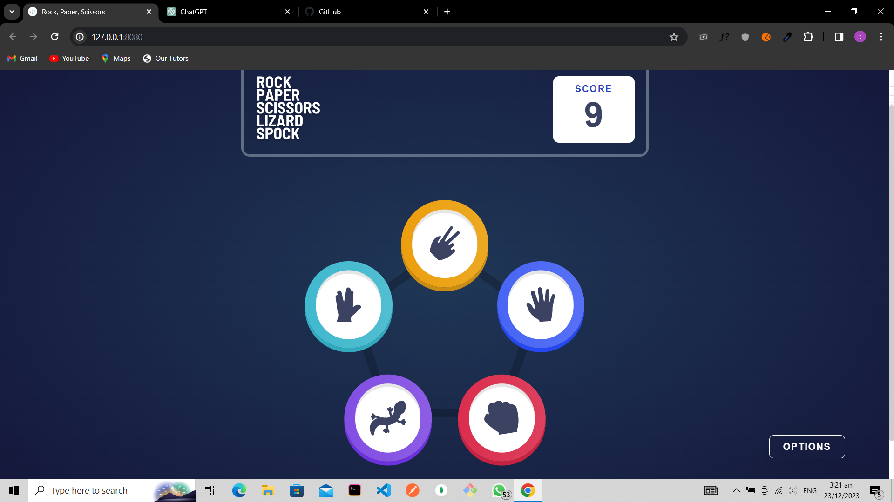
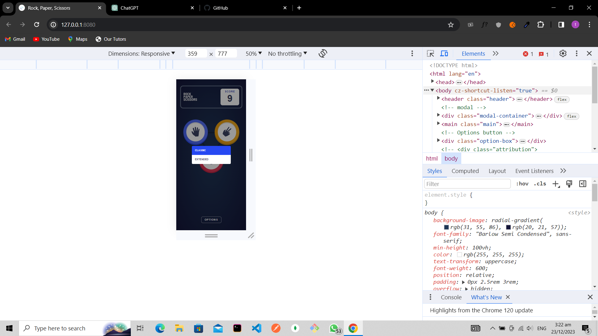

# Frontend Mentor - Rock, Paper, Scissors solution

This is a solution to the [Rock, Paper, Scissors challenge on Frontend Mentor](https://www.frontendmentor.io/challenges/rock-paper-scissors-game-pTgwgvgH). Frontend Mentor challenges help you improve your coding skills by building realistic projects.

---

## Table of Contents

- [Overview](#overview)
  - [The Challenge](#the-challenge)
  - [Screenshot](#screenshot)
  - [Links](#links)
- [My Process](#my-process)
  - [Built With](#built-with)
  - [What I Learned](#what-i-learned)
  - [Continued Development](#continued-development)
- [Author](#author)
- [Acknowledgments](#acknowledgments)

---

## Overview

Welcome to the **Rock Paper Scissors Lizard Spock** game! 🎮 This project is a modern twist on the classic game of Rock Paper Scissors, offering an extended version with five possible choices. It's a fun and interactive game where you compete against the house to see who comes out on top! 🌟

### The Challenge

Users should be able to:

- View the optimal layout for the game depending on their device's screen size
- Play Rock, Paper, Scissors against the computer
- Maintain the state of the score after refreshing the browser _(optional)_
- **Bonus**: Play Rock, Paper, Scissors, Lizard, Spock against the computer _(optional)_

### Screenshot

### Links

- [GitHub Repository](https://github.com/naijadevgamer/rock-paper-scissors)
- [Live Demo](https://thenaijagamer.github.io/rock-paper-scissors/)

---

## My Process

I utilized HTML, SCSS, and JavaScript to bring this project to life. Attention to detail was crucial to mimic the provided design as closely as possible while ensuring a smooth and interactive user experience. Here are some highlights:

### Built With

- **HTML & SCSS** (Sass) - To structure and style the game interface, making it visually appealing and responsive. 🎨
- **JavaScript** - For handling game logic, player interactions, and DOM manipulations. 🖥️

### 📚 Features

- **Classic and Extended Modes**: Choose between the classic Rock-Paper-Scissors mode and the extended Rock-Paper-Scissors-Lizard-Spock mode. 🕹️
- **Player and House Picks**: Both the player and the house make their picks, with icons displayed on the screen. The game then determines the winner based on the chosen options. 🏆
- **Dynamic Status Display**: The game dynamically displays the result of each round, informing the player whether it's a tie, win, or loss. 💬
- **Score Tracking**: Your score is tracked across games and saved in the browser’s local storage, so you can always see how well you're doing! 📈
- **Play Again Option**: After each round, easily start a new game to continue the fun. 🔄
- **Responsive UI**: The game features a us

### What I Learned

Throughout this project, I honed my skills in writing clean, maintainable code by adhering to the DRY (Don't Repeat Yourself) principle. Additionally, I delved deeper into JavaScript to ensure an optimal user experience and learned how to make my code even more efficient.

### Continued Development

I'm planning to introduce sound features and a reset score option in the future to further enhance the gaming experience. Continuously refining my JavaScript skills to write even cleaner and more efficient code remains a priority.

---

## Author

[Saleeman Abdullahi Alaba Aransiola]

- Github - [My GitHub Profile](https://github.com/naijadevgamer)
- Frontend Mentor - [@naijadevgamer](https://www.frontendmentor.io/profile/naijadevgamer)
- Twitter - [@naijadevgamer](https://www.twitter.com/naijadevgamer)
- LinkedIn - [Abdullah Saleeman](https://www.linkedin.com/in/abdullah-saleeman-360170243)
- Contact - [sabdullahialaba50@gmail.com](mailto:sabdullahialaba50@gmail.com)

---

## Acknowledgments

I extend my gratitude to the Almighty ALLAH for guiding me through this project.
